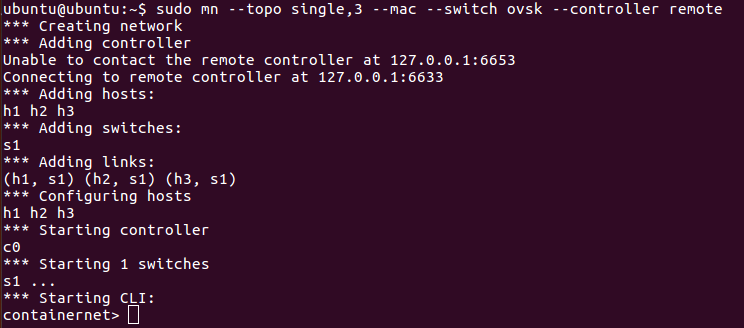
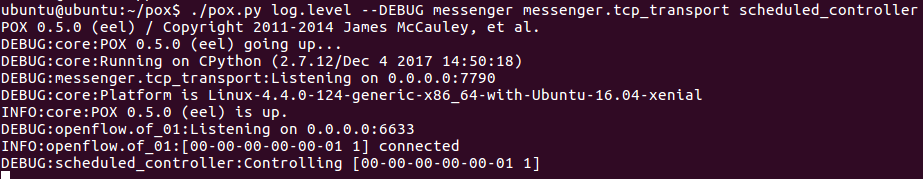

# DTN\_simulator

Simulator: Simulate a Disruptive tolerant network with docker containers
Needs: 
  * Containernet: https://containernet.github.io/
  * Pox: https://github.com/noxrepo/pox.git

Installation:
After installation, this repo should go $POX\_DIR/ext

# Usage:

Start a topology with containernet:
* sudo mn --topo single,3 --mac --switch ovsk --controller remote

The output should look like this:

Starts the controller using the messenger plugin
  $ cd $POX\_DIR/
  ~/pox$ ./pox.py log.level --DEBUG messenger messenger.tcp\_transport scheduled\_controller

A successful start looks as follows:

Finally, feed switches information to the controller, create the schedule based on a contact plan
 ubuntu@ubuntu:~/pox/ext$ python test\_client.py 
 
An example of a text file for feeding the controller and schedule is provided on "simulator/infos/cmds\_test.txt"
