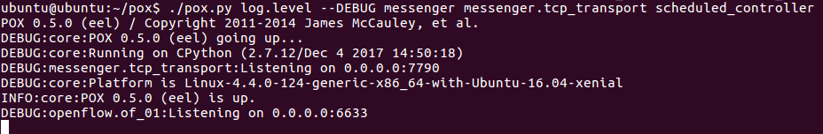
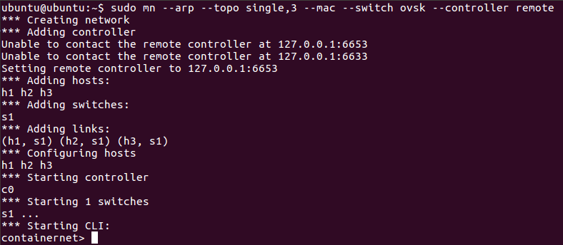

# DTN\_simulator

Simulate Disruptive tolerant networks with docker containers

Requirements:
  * Containernet: https://containernet.github.io/
  * Pox: https://github.com/noxrepo/pox.git

Installation:
After installing the requirements, download this repo under $POX/ext

# How to simulate a DTN network:

A simulation uses container net to create the network topology, pox to as
SDN controller and a simple application to set and delete connection in
runtime based on a schedule.
By now a description of mac to ports is also needed, but it should later on
disappear, since this information can be requested from OVSwitch by SDN controller.
The visualisation APP is red, because it is not yet implemented.
The goal is to allow the network visualization in runtime based on events
triggered by the SDN controller.

# Example:

* Starts the controller using the messenger plugin

```
$ cd $POXDIR/
pox$ ./pox.py messenger messenger.tcp\_transport scheduled\_controller
```

A successful start looks as follows:


obs: You can use the option DEBUG, you can ignore the output:
"WARNING:scheduled_controller:Dropping packet".
Currently we are dropping everything but the communication between the nodes we
explicit allow.

Running for debug:
```
$ cd $POXDIR/
pox$ ./pox.py log.level --DEBUG messenger messenger.tcp\_transport scheduled\_controller
```

* In another window, run containernet (so far just flat topology is supported)

```
sudo mn --arp --topo single,3 --mac --switch ovsk --controller remote
```
obs.: --arp and --mac are required.

The output should look like this:


Notice also that in the first window the pox status should be "connected".

So far we have the containers, switch and controller running.

# The APP

The application needs as input mac2ports mapping and the schedule.
There is a simple example on $POXDIR/ext/infos/cmds_test.txt
Based on this file the app is able to tell the controller which flows it should
enable/disable and the right time to it.

Running the app

```
~/pox/ext$ python scheduler.py
```

An example of a text file for feeding the controller and schedule is provided on "simulator/infos/cmds\_test.txt"
